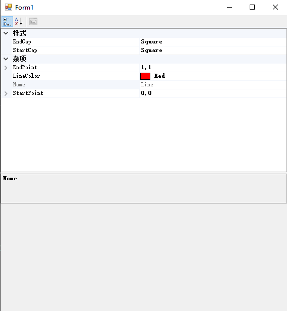
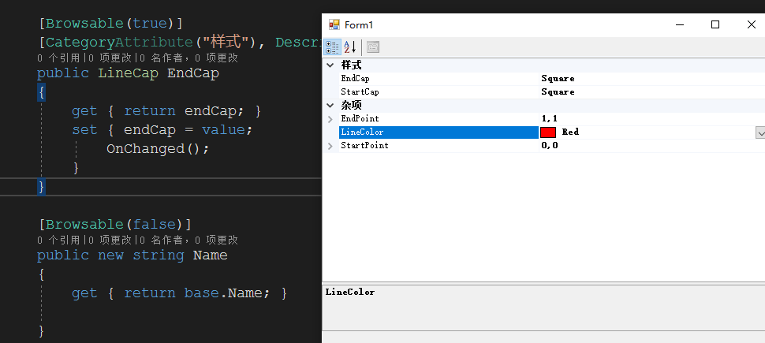
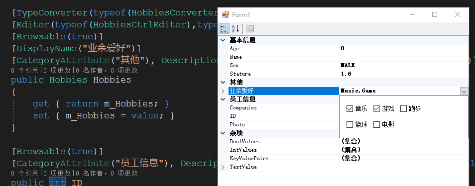
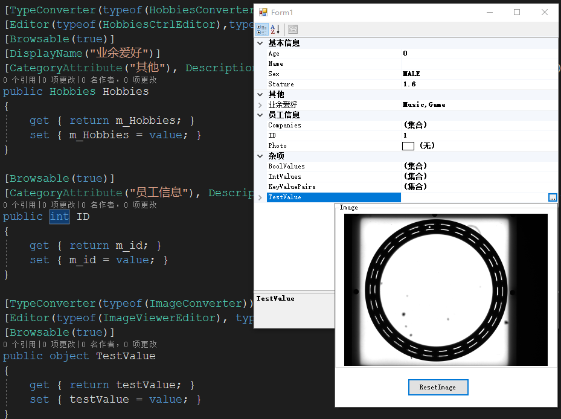
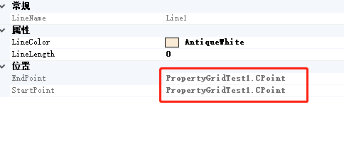
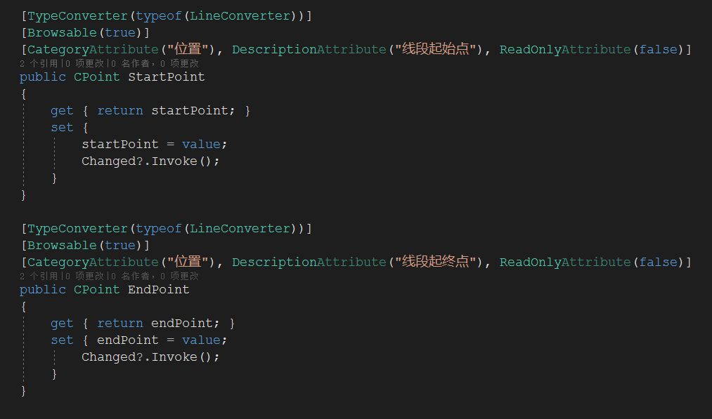
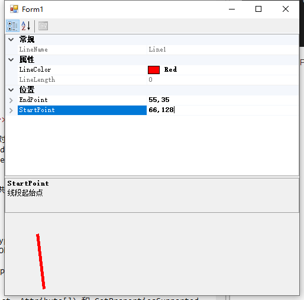

#<center><font fcae="黑体" size=12 color=red>ReadMe</font></center>#
---

##测试记录

1.[2020-3-2 21:53] 添加PropertyGridTest1主要测试PropertyGrid基础功能。

2.[2020-3-4 13:12] 添加PropertyGridTest2主要测试复杂属性（类）中如果有父类，怎样控制父类中的属性显示及修改问题。  

3.[2020-3-5 11:42] 添加PropertyGridTest3主要测试PropertyGrid修改复杂属性使用自定义控件。  


##测试结果

【1】PropertyGrid无法显示复杂属性中具体信息，如果需要修改复杂属性需要添加转换器（TypeConverter）;  
【2】父类中的属性不做任何标记也可以显示在“杂项”中，默认可以被修改，但是复杂依然需要提供相应的转换器，如下图所示
<center></center>  
如上图所示，父类中的所有属性都显示了，而且在没有任何Attribute标记的情况下只要有set访问器就可以被修改，这样带来一个严重的问题，并不是所有情况下都允许用户修改父类中的属性，这时需要考虑如何在子类中控制这些属性的显示。隐藏掉父类中的属性方法如下图所示：
<center></center>
【3】在PropertyGrid中可以使用自定义控件修改复杂属性，需要为复杂控件提供特定的转换器（TypeConverter）的同时，还需要为自定义控件提供特定的UITypeEditor，详见代码。另外，如果需要在PropertyGrid中显示中文属性名的话，可以在属性头上用[DisplayName]标注出来。
<center></center>
<center></center>
##修改记录    

1.[2020-3-3 11:22] 在为对象添加自定义复杂属性时，PropertyGrid无法显示属性内部信息，以及无法修改属性内部数据（如下图所示）。为此要解决这个问题必须添加转换器。  

<center></center>   
```
public class LineConverter:TypeConverter
    {

        /// <summary>
        /// 判断可以从哪些类型转换而来
        /// </summary>
        /// <param name="context"></param>
        /// <param name="sourceType"></param>
        /// <returns></returns>
        public override bool CanConvertFrom(ITypeDescriptorContext context, Type sourceType)
        {
            if (sourceType == typeof(string))
            {
                return true;    
            }
            return base.CanConvertFrom(context, sourceType);
        }

        /// <summary>
        /// 判断可以转换成哪些类型
        /// </summary>
        /// <param name="context"></param>
        /// <param name="destinationType"></param>
        /// <returns></returns>
        public override bool CanConvertTo(ITypeDescriptorContext context, Type destinationType)
        {
            //判断是否可以从string类型转换而来
            if (destinationType == typeof(string))
                return true;
            if (destinationType == typeof(InstanceDescriptor))//InstanceDescriptor提供创建对象信息的类型
                return true;
            return base.CanConvertTo(context, destinationType);
        }

        /// <summary>
        /// 将类型转换成字符串
        /// </summary>
        /// <param name="context"></param>
        /// <param name="culture"></param>
        /// <param name="value"></param>
        /// <param name="destinationType"></param>
        /// <returns></returns>
        public override object ConvertTo(ITypeDescriptorContext context, CultureInfo culture, object value, Type destinationType)
        {
            if (destinationType == typeof(string) && value != null)
            {
                CPoint point = value as CPoint;
                string str = string.Format($"{point.PointX},{point.PointY}");
                return str;
            }

            if (destinationType == typeof(InstanceDescriptor) && value!=null)
            {
                ConstructorInfo constructorInfo = typeof(CPoint).GetConstructor(new Type[] { typeof(int),typeof(int) });
                CPoint point = value as CPoint;
                return new InstanceDescriptor(constructorInfo,new object[] { point.PointX,point.PointY});
            }
            return base.ConvertTo(context, culture, value, destinationType);    
        }


        public override object ConvertFrom(ITypeDescriptorContext context, CultureInfo culture, object value)
        {
            if (value is string)
            {
                string str = value as string;
                string[] p = str.Split(',');
                if (p.Length != 2)
                {
                    throw new NotSupportedException("非法参数类型");
                }

                int X = 0;
                int Y = 0;
       
                bool result = int.TryParse(p[0],out X);
                if (!result)
                    throw new NotSupportedException("输入参数出错");
                //
                result = int.TryParse(p[1], out Y);
                if (!result)
                    throw new NotSupportedException("输入参数出错");

                CPoint point = new CPoint(X,Y);


                return point;
            }

            return base.ConvertFrom(context, culture, value);
        }

        public override bool GetPropertiesSupported(ITypeDescriptorContext context)
        {
            return true;
            //return base.GetPropertiesSupported(context);
        }
        public override PropertyDescriptorCollection GetProperties(ITypeDescriptorContext context, object value, Attribute[] attributes)
        {
            return TypeDescriptor.GetProperties(value, attributes);
            //return base.GetProperties(context, value, attributes);
        }

    }
```

在添加转换器类之后需要标识那些类需要被转换，如下图所示：
<center></center>  

转换后便可以在PropertyGrid中修改复杂属性值了
<center></center>  
-----
##学习
###<center><font face="宋体" size=6 color=blue>一、转换器</font></center>

&emsp;&emsp;PropertyGrid中属性的值都是以字符串的形式呈现给我们看的，显示一个对象的属性时，要将对象的属性值转换为字符串显示出来，而设置属性时，要将字符串转换为对象的属性值。这就需要一个转换器。<font color=red>在.Net中定义了一个TypeConverter 类，用来作为这些转换器的基类。.Net为一些类设计了专门的转换类，如：System.Drawing.ColorConverter ，System.Drawing.FontConverter等等，（具体参见MSDN中TypeConverter的继承关系）因此在PropertyGrid中能直接编辑这些属性。我们自己定义的类没有这样的类型转换器，因此在PropertyGrid中无法编辑，需要设计自己的转换器。</font>  
&emsp;&emsp;在MSDN上详细介绍了TypeConverter继承者说明。TyperConverter类提供一种将值的类型转换为其它类型及访问标准值和子属性的同一方法。  
<center></center>  
&emsp;&emsp;<font color=red>继承者说明</font>  
从 TypeConverter 继承以实现您自己的转换要求。 从此类继承时，可以重写以下方法： -若要支持自定义类型转换，请重写 CanConvertFrom(ITypeDescriptorContext, Type)、CanConvertTo(ITypeDescriptorContext, Type)、ConvertFrom(ITypeDescriptorContext, CultureInfo, Object)和 ConvertTo(ITypeDescriptorContext, CultureInfo, Object, Type) 方法。    

-若要转换必须重新创建对象以更改其值的类型，请重写 CreateInstance(ITypeDescriptorContext, IDictionary) 和 GetCreateInstanceSupported(ITypeDescriptorContext) 方法。  

-若要转换支持属性的类型，请重写 GetProperties(ITypeDescriptorContext, Object, Attribute[]) 和 GetPropertiesSupported(ITypeDescriptorContext) 方法。 如果要转换的类不具有属性，并且您需要实现属性，则可以使用 TypeConverter.SimplePropertyDescriptor 类作为实现属性说明符的基础。 从 TypeConverter.SimplePropertyDescriptor继承时，必须重写 GetValue(Object) 和 SetValue(Object, Object) 方法。

-若要转换支持标准值的类型，请重写 GetStandardValues(ITypeDescriptorContext)、GetStandardValuesExclusive(ITypeDescriptorContext)、GetStandardValuesSupported(ITypeDescriptorContext) 和 IsValid(ITypeDescriptorContext, Object) 方法。


