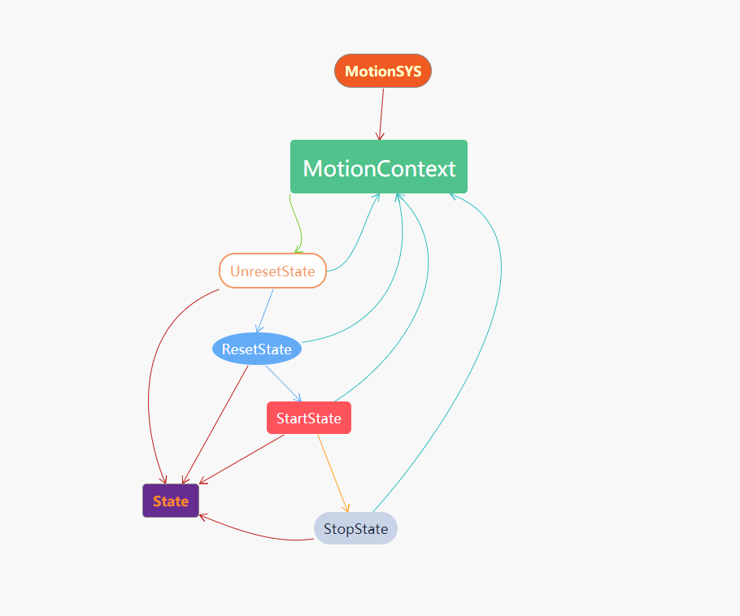
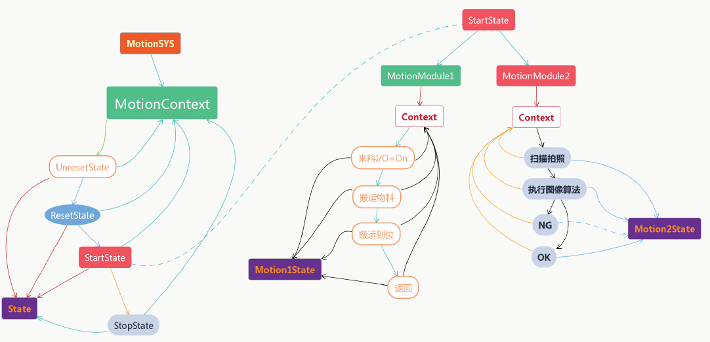
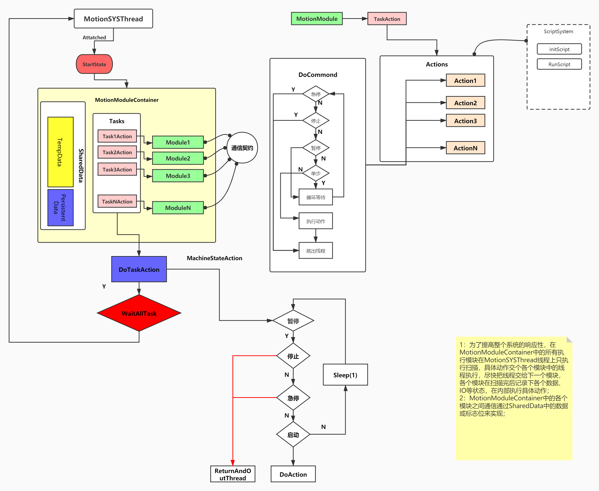
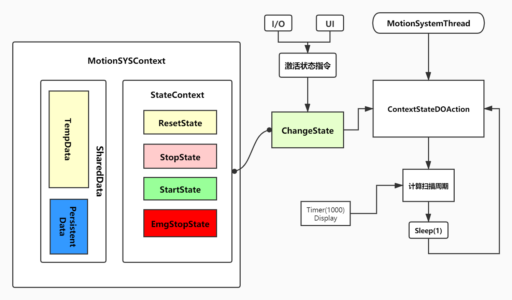

#**
`ReadMe`
**

-----

##Smuary   
最近在准备做一个控制20个轴的项目，此前做8个轴的项时发现一个问题，就是轴数越多IO点越多对于上位机而言所使用到的If、switch等条件判断就越过，而且很容易嵌套多层，在PLC的梯形图中多个条件害死比较容易看的，但是实在上位机中多个if条件不管是对于阅读者还是维护者都是噩梦。所以在开发20多个轴项目之前就在思考这个问题，到底如何准确、高效而又优雅的开发运行控制系统的运行逻辑部分，偶然的一次机会在CSDN中看到了关于与状态机（FSM）的文章，也是由改文章的启发来研究一下设计模式中的状态模式（StatePattern）,接下来还会研究一下与状态模式类似的策略模式（StrategyPattern） ——2020-7-8

-----
##测试一【StatePattern】

【2020-7-7】 在Statepattern中初步了解了StatePatter模式的构造。在状态模式中主要包含:（1）Context：环境类，也可以理解是ConcreteState的管理类；（2） State:抽象状态类; (3) ConcreteState:具体状态类，在每个Context所要描述的系统中，每个可以独立的状态都可以是一个具体状态类（ConcreteState）;

##测试二【StatePatternTest2】  

【2020-7-8】 在StatePatternTest2中模拟测试了如下图状态   
   
在写完这测试后，对状态模式有了更进一步的了解。对于多轴运动控制系统的构想是，将运动控制系统分成多个模块，比如上料模块、下料模块、拍照模块等，在每个模块中使用状态模式。比如在上料模块中有检测到来料状态、抓取物料状态，搬运物料状态、搬运物料达到状态等。但是还有一些细节需要考虑和测试，比如在每个模块中如何抛出数据给界面显示、如何控制设备启停等。这些问题将在测试3中去解决。

##测试三【StatePatternTest3】
【2020-7-17】在StatePatternTest3中模拟测试如下图所示的功能   
  
在上图中基本模拟一个简单运动控制系统的结构，测试结果还是比较完美的，State模式能够完美的开各个状态，使得复杂运动控制程序编写变得简单并且程序本身灵活可靠！在编写这个测试程序的过程中对新版本的运动控制系统有了一些思考，整体结构图下图所示。   
      

 
